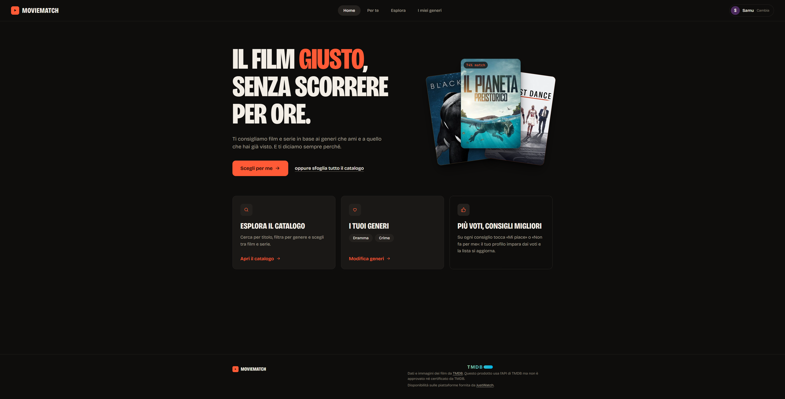
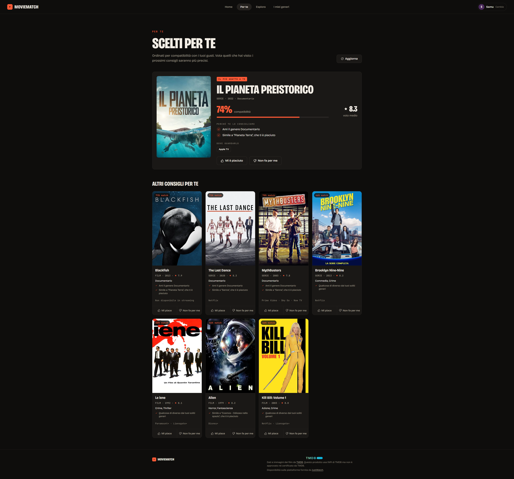
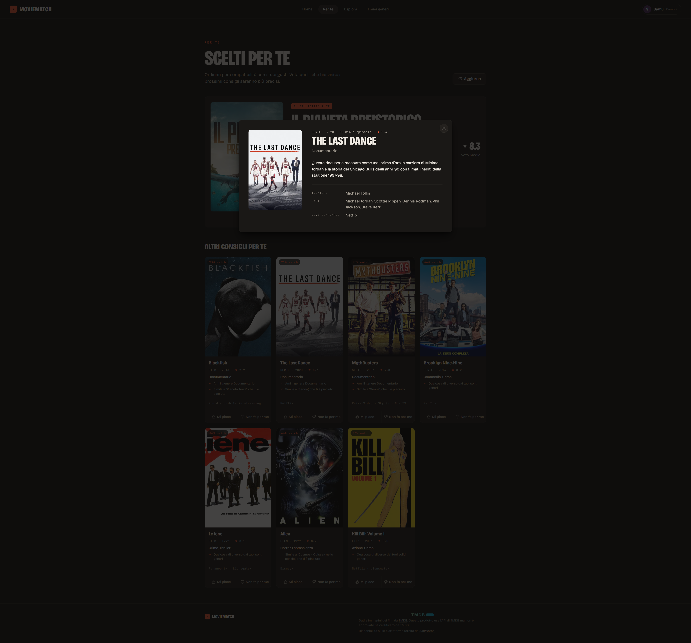

# 🎬 MovieMatch

Motore di raccomandazione **content-based** per film e serie TV: costruisce un profilo di
gusti a partire da quello che l'utente dichiara e da quello che vota, e usa quel profilo
per consigliare titoli nuovi, spiegando ogni volta **perché** li sta consigliando.

Progetto full-stack in TypeScript: API REST con Express + MongoDB, interfaccia React + Vite,
catalogo di film e serie importato da [TMDB](https://www.themoviedb.org/).

---





---

## Indice

- [Funzionalità](#funzionalità)
- [Stack tecnologico](#stack-tecnologico)
- [Requisiti](#requisiti)
- [Installazione](#installazione)
- [Configurazione (.env)](#configurazione-env)
- [Popolare il database](#popolare-il-database)
- [Avviare l'applicazione](#avviare-lapplicazione)
- [Pubblicazione](#pubblicazione)
- [Profili e privacy](#profili-e-privacy)
- [API](#api)
- [Come funziona il motore di raccomandazione](#come-funziona-il-motore-di-raccomandazione)
- [Struttura del progetto](#struttura-del-progetto)
- [Sviluppi futuri](#sviluppi-futuri)
- [Limitazioni note](#limitazioni-note)
- [Crediti](#crediti)

---

## Funzionalità

### Profili

- **Profili senza registrazione**: si crea un profilo con il solo nome, senza email né password.
- **Profili del dispositivo**: ogni browser vede solo i profili creati lì
  (vedi [Profili e privacy](#profili-e-privacy)).
- **Generi preferiti** scelti dall'utente in "I miei generi", usati come punto di partenza del profilo.

### Raccomandazioni

- Motore content-based con punteggio pesato su **generi, tag, qualità e persone** (regista o
  ideatore, cast).
- **Spiegazione di ogni consiglio**: "Ami il genere Crime", "Simile a Breaking Bad, che ti è
  piaciuto", "Ti piace il regista Christopher Nolan"…
- Percentuale di **compatibilità** con il profilo.
- **Decadimento temporale**: i voti recenti pesano più di quelli vecchi (emivita di un anno).
- **Varietà**: al massimo 4 titoli per genere nella stessa lista.
- Penalità per i titoli che non sono sulle piattaforme attive dell'utente.
- I titoli già votati non vengono più proposti.

### Voti

- "Mi piace" / "Non fa per me" su ogni consiglio; i consigli si ricalcolano subito.
- **Annullare un voto**: dopo ogni voto compare per 6 secondi l'avviso "Hai votato «X» — Annulla".

### Catalogo

- **Film e serie TV** importati da TMDB, con poster, trama, durata, regista o ideatore, cast,
  keyword e piattaforme di streaming in Italia.
- **Esplora**: tutto il catalogo, con ricerca per titolo, filtro per genere e per tipo
  (film / serie) e paginazione.
- **Scheda del titolo**: cliccando un poster si apre una finestra con trama, durata, generi,
  regia (o ideatore per le serie), cast e piattaforme.
- I titoli senza piattaforme in abbonamento mostrano "Non disponibile in streaming".

### Interfaccia

- Layout responsive, dal telefono (320 px) al desktop.
- Animazioni che rispettano `prefers-reduced-motion`.
- Due palette colori, "redesign" (predefinita) e "classico", con contrasto AA: si sceglie con
  l'attributo `data-tema` su `<html>` in `client/index.html`.
- Messaggi di errore visibili all'utente, con pulsante **Riprova** quando il server non
  risponde (per esempio alla prima richiesta dopo un periodo di inattività).
- Crediti TMDB (con logo ufficiale) e JustWatch nel footer.

### Backend

- API REST tipizzata in TypeScript, errori sempre in JSON (`{ "errore": "…" }`), anche per
  JSON malformato, rotte inesistenti e database non raggiungibile.
- **Limite di richieste** sulle rotte che scrivono nel database (`express-rate-limit`).
- Script di **migrazione** ripetibile per aggiornare i dati già salvati.

---

## Stack tecnologico

**Backend**
- Node.js + TypeScript (ESM)
- Express 5, `express-rate-limit`
- Mongoose 9 / MongoDB
- `tsx` per il dev server con watch e per gli script del database

**Frontend**
- React 19
- Vite 8
- TypeScript
- SCSS (Sass) con architettura BEM e temi basati su custom property CSS

**Dati esterni**
- [The Movie Database (TMDB)](https://www.themoviedb.org/): catalogo, poster e trame
- [JustWatch](https://www.justwatch.com/), tramite TMDB: disponibilità sulle piattaforme

---

## Requisiti

- **Node.js 20+**
- **MongoDB**: locale su `mongodb://localhost:27017` oppure un cluster MongoDB Atlas
- Una **API key TMDB** gratuita, per importare il catalogo
  (si ottiene da [themoviedb.org/settings/api](https://www.themoviedb.org/settings/api))

---

## Installazione

```bash
git clone <url-del-repository>
cd App_Generatore_Film
```

Installa le dipendenze del backend:

```bash
npm install
```

Installa le dipendenze del client:

```bash
npm --prefix client install
```

---

## Configurazione (.env)

Crea un file `.env` nella cartella principale del progetto, partendo da `.env.example`:

```bash
cp .env.example .env
```

| Variabile | Obbligatoria | Default | Descrizione |
|---|:---:|---|---|
| `PORT` | no | `3001` | Porta su cui ascolta il server Express |
| `MONGODB_URI` | **sì** | — | Stringa di connessione MongoDB (es. `mongodb://localhost:27017/moviematch`) |
| `TMDB_API_KEY` | solo per l'import | — | Chiave API di TMDB, usata da `npm run importa` e `npm run importa:serie` |

> ⚠️ Il file `.env` è in `.gitignore`: non va **mai** committato, contiene la chiave TMDB e
> la password del database.

> 💡 Conviene usare due database diversi per sviluppo e produzione: basta cambiare il nome
> del database nell'URI (la parte tra `.mongodb.net/` e `?`). MongoDB crea il database
> alla prima scrittura.

---

## Popolare il database

### Import da TMDB (catalogo reale)

```bash
npm run importa          # film
npm run importa:serie    # serie TV
```

Lo script è lo stesso: l'argomento `serie` sceglie l'endpoint di TMDB, i generi e il campo
della data. Per ogni genere scarica i titoli più votati (almeno 300 voti, già usciti), con
cast, regista o ideatore, keyword, poster e piattaforme italiane. In pratica:
circa 240 film e 175 serie.

Ogni import **sostituisce solo i titoli del suo tipo**: importare le serie non tocca i film,
e viceversa. Dopo l'import vengono tolti dagli storici solo i voti rimasti "orfani", cioè
quelli sui titoli sostituiti (gli id dei titoli reimportati cambiano).

Durante l'import:
- i generi TV vengono tradotti in quelli dei film ("Action & Adventure" → Azione + Avventura,
  "Sci-Fi & Fantasy" → Fantascienza + Fantasy, "War & Politics" → Guerra, "Kids" → Famiglia);
  News, Reality, Soap e Talk vengono esclusi;
- i nomi delle piattaforme vengono uniformati ("Disney Plus" → "Disney+",
  "Paramount Plus Apple TV channel" → "Paramount+", i canali Amazon → il servizio).

Parametri modificabili in `src/seed/importaTMDB.ts`:

| Costante | Default | Cosa fa |
|---|:---:|---|
| `PAGINE_PER_GENERE` | `1` | Pagine TMDB scaricate per genere (20 titoli a pagina) |
| `VOTI_MINIMI` | `300` | Esclude i titoli con pochi voti |
| `LINGUA` | `it-IT` | Lingua di titoli e trame |
| `PAUSA_MS` | `100` | Pausa tra le chiamate, per non saturare l'API |

### Catalogo di esempio (veloce, offline)

Inserisce 24 titoli scritti a mano (film e serie) e crea un utente di prova con uno storico
già popolato. Non serve la chiave TMDB.

```bash
npm run seed
```

> ⚠️ Il seed **svuota** le collezioni `films` e `utenti` prima di inserire i dati.

L'utente di prova non compare nella schermata dei profili, perché ogni browser vede solo i
profili creati lì (vedi [Profili e privacy](#profili-e-privacy)): serve per provare le API,
per esempio `GET /api/raccomandazioni/<id>`. Dall'interfaccia basta creare un profilo nuovo.

### Migrazione dei dati già salvati

```bash
npm run migrazione
```

Aggiorna un database creato con una versione precedente dell'app: toglie il vecchio campo
`email` dai profili (e il suo indice unico) e uniforma i nomi delle piattaforme sui titoli
già salvati. Si può lanciare più volte: la seconda volta non cambia niente.

Per lanciarla su un database diverso da quello del `.env` (per esempio quello di
produzione), in PowerShell basta impostare la variabile solo per quel terminale:

```powershell
$env:MONGODB_URI = "<URI del database>"; npm run migrazione
```

---

## Avviare l'applicazione

Servono **due terminali**, entrambi nella cartella principale.

Terminale 1, backend (`http://localhost:3001`):

```bash
npm run dev
```

Terminale 2, client (`http://localhost:5173`):

```bash
npm --prefix client run dev
```

Apri **http://localhost:5173**. Il dev server di Vite inoltra tutte le chiamate `/api/*`
al backend sulla porta 3001 (vedi `client/vite.config.ts`), quindi in sviluppo non serve
configurare CORS.

### Altri comandi

| Comando | Dove | Cosa fa |
|---|---|---|
| `npm run dev` | radice | Backend in watch mode |
| `npm run build` | radice | Compila il backend in `dist/` |
| `npm start` | radice | Avvia il backend compilato |
| `npm run importa` | radice | Importa i film da TMDB |
| `npm run importa:serie` | radice | Importa le serie TV da TMDB |
| `npm run migrazione` | radice | Aggiorna i dati già salvati |
| `npm run seed` | radice | Popola il database col catalogo di esempio |
| `npm run dev` | `client/` | Dev server Vite |
| `npm run build` | `client/` | Build di produzione del client |
| `npm run lint` | `client/` | ESLint sul client |

---

## Pubblicazione

L'app è pubblicata su **Vercel** con due progetti, uno per il backend e uno per il frontend:

- **backend**: `src/index.ts` esporta l'app Express (`export default app`) e su Vercel non
  chiama `app.listen`. La variabile `MONGODB_URI` va impostata nelle impostazioni del
  progetto Vercel. `app.set("trust proxy", 1)` serve perché il limite di richieste veda
  l'IP vero del visitatore e non quello del proxy di Vercel.
- **frontend**: la build di Vite (cartella `client/`). `client/vercel.json` inoltra le
  chiamate `/api/*` al backend, così il browser parla con un solo dominio.

Solo i file in `client/public/` vengono copiati così come sono nella build: le immagini
usate con un percorso assoluto (`src="/…"`) devono stare lì.

---

## Profili e privacy

L'app non ha login: i profili servono a tenere separati i gusti, non a proteggere dati
personali, e infatti di ogni profilo si salvano solo **nome, generi preferiti e voti**.

- Quando crei un profilo, il suo id viene salvato nel `localStorage` del browser
  (`moviematch:profili`). La schermata dei profili chiede al server solo quelli
  (`GET /api/utenti?ids=…`): chi apre l'app da un altro dispositivo non vede i tuoi.
- Il profilo attivo è in `moviematch:utente`. Se il server non lo trova più, l'app lo toglie
  dall'elenco e torna alla scelta del profilo.
- Non esiste una rotta che elenchi tutti i profili.

---

## API

Tutti gli endpoint sono sotto il prefisso `/api`. Le risposte sono in JSON e i messaggi
d'errore hanno sempre la forma `{ "errore": "descrizione" }`.

| Metodo | Endpoint | Descrizione | Limite |
|---|---|---|---|
| `GET` | `/api/utenti?ids=id1,id2` | I profili indicati (massimo 20) | — |
| `GET` | `/api/utenti/:utenteId` | Un profilo | — |
| `POST` | `/api/utenti` | Crea un profilo | 10 all'ora |
| `PUT` | `/api/utenti/:utenteId/preferenze` | Aggiorna i generi preferiti | 60 ogni 15 min |
| `POST` | `/api/utenti/:utenteId/visioni` | Registra un voto | 60 ogni 15 min |
| `DELETE` | `/api/utenti/:utenteId/visioni/:filmId` | Annulla un voto | 60 ogni 15 min |
| `GET` | `/api/raccomandazioni/:utenteId` | Consigli personalizzati | — |
| `GET` | `/api/film` | Catalogo (ricerca, filtro genere/tipo, paginazione) | — |
| `GET` | `/api/film/:filmId` | Scheda di un titolo | — |
| `GET` | `/api/generi` | Generi presenti a catalogo, con conteggio | — |

I limiti valgono per indirizzo IP; oltre il limite la risposta è `429`.

Errori comuni a tutte le rotte: `400` JSON malformato o id non valido · `404` rotta o
risorsa inesistente · `413` richiesta troppo grande · `429` troppe richieste ·
`503` database non raggiungibile · `500` errore interno.

### `GET /api/utenti?ids=…`

```json
[
  {
    "_id": "6a7f4ec1c05324d5adec8077",
    "nome": "Samuele",
    "generiPreferiti": ["Fantascienza", "Thriller"]
  }
]
```

Senza `ids` la risposta è `400`: l'elenco completo dei profili non è disponibile.
`GET /api/utenti/:utenteId` restituisce lo stesso oggetto per un solo profilo.

### `POST /api/utenti`

```json
{ "nome": "Giulia" }
```

Risposta `201`:

```json
{
  "_id": "6a7f4ec1c05324d5adec8099",
  "nome": "Giulia",
  "generiPreferiti": []
}
```

Errori: `400` nome mancante o più lungo di 60 caratteri.

### `PUT /api/utenti/:utenteId/preferenze`

```json
{ "generiPreferiti": ["Fantascienza", "Thriller", "Crime"] }
```

### `POST /api/utenti/:utenteId/visioni`

```json
{ "filmId": "6a7f4ec1c05324d5adec8080", "valutazione": 4 }
```

`valutazione` è un intero da 1 a 5. L'interfaccia usa 4 per "Mi piace" e 2 per "Non fa per me".

Risposta `201`:

```json
{
  "messaggio": "Visione registrata",
  "titolo": "Blade Runner 2049",
  "valutazione": 4,
  "totaleVisioni": 6
}
```

Errori: `400` id o voto non validi · `404` utente o titolo inesistente ·
`409` titolo già votato.

### `DELETE /api/utenti/:utenteId/visioni/:filmId`

Risposta `200`: `{ "messaggio": "Voto annullato" }`.
Errori: `404` utente inesistente o voto non trovato.

### `GET /api/raccomandazioni/:utenteId`

Query string opzionale: `?limite=8` (valori ammessi da 6 a 8).

```json
{
  "totale": 8,
  "raccomandazioni": [
    {
      "id": "6a7f4ec1c05324d5adec8080",
      "titolo": "Breaking Bad",
      "tipo": "serie",
      "anno": 2008,
      "generi": ["Dramma", "Crime"],
      "piattaforme": ["Netflix"],
      "posterUrl": "https://image.tmdb.org/t/p/w500/...",
      "votoMedio": 9,
      "compatibilita": 72,
      "motivi": ["Ami il genere Dramma", "Molto apprezzato (9/10)"],
      "punteggio": 0.58
    }
  ]
}
```

Errori: `404` utente non trovato.

### `GET /api/film`

Query string, tutti i parametri opzionali:

| Parametro | Default | Descrizione |
|---|:---:|---|
| `pagina` | `1` | Numero di pagina (parte da 1) |
| `perPagina` | `20` | Titoli per pagina (massimo 50) |
| `genere` | — | Filtra per un genere esatto |
| `tipo` | — | `film` oppure `serie` |
| `ricerca` | — | Ricerca sul titolo (senza distinzione tra maiuscole e minuscole) |

```json
{
  "totale": 414,
  "pagina": 1,
  "perPagina": 20,
  "film": [
    {
      "id": "6a7f4ec1c05324d5adec8080",
      "titolo": "Blade Runner 2049",
      "tipo": "film",
      "anno": 2017,
      "generi": ["Fantascienza", "Dramma"],
      "piattaforme": ["Netflix"],
      "posterUrl": "https://image.tmdb.org/t/p/w500/...",
      "votoMedio": 8.1,
      "descrizione": "Trent'anni dopo gli eventi del primo film..."
    }
  ]
}
```

### `GET /api/film/:filmId`

```json
{
  "id": "6abf6beb1cd00ee3e02f045d",
  "titolo": "Senna",
  "tipo": "film",
  "anno": 2010,
  "durataMinuti": 106,
  "generi": ["Documentario"],
  "piattaforme": ["MUBI"],
  "regista": "Asif Kapadia",
  "cast": ["Ayrton Senna", "Alain Prost", "Frank Williams", "Ron Dennis", "Viviane Senna"],
  "posterUrl": "https://image.tmdb.org/t/p/w500/...",
  "votoMedio": 8.1,
  "descrizione": "Ayrton Senna da Silva nasce a San Paolo..."
}
```

Per le serie `regista` contiene l'ideatore e `durataMinuti` la durata di un episodio.
Errori: `400` id non valido · `404` titolo non trovato.

### `GET /api/generi`

```json
[
  { "genere": "Dramma", "quanti": 142 },
  { "genere": "Thriller", "quanti": 98 }
]
```

---

## Come funziona il motore di raccomandazione

Il motore è **content-based**: non confronta l'utente con altri utenti, ma confronta i
titoli tra loro in base alle loro caratteristiche. Funziona quindi anche con un solo utente
registrato, senza il problema del *cold start* dei sistemi collaborativi.

### 1. Costruzione del profilo (`src/services/profiloUtente.ts`)

Il profilo è fatto di tre mappe: **generi**, **tag** e **nomi** (registi, ideatori e attori),
ognuna con un punteggio di affinità.

- I **generi dichiarati** dall'utente partono con un peso di `1.5`.
- Ogni **voto** contribuisce con un peso pari a `voto − 3`, quindi:
  - voto 5 → `+2` (piaciuto molto)
  - voto 4 → `+1`
  - voto 3 → `0` (neutro, ignorato)
  - voto 2 → `−1`
  - voto 1 → `−2` (non piaciuto per niente)
- Il peso viene moltiplicato per un **fattore di decadimento temporale** con emivita di
  **365 giorni**: un voto di un anno fa conta la metà di uno di oggi.
- Il contributo si distribuisce così: pieno sui generi, `×0.5` sui tag, pieno sul regista
  (o ideatore), `×0.3` su ciascun attore del cast. I titoli senza regista non aggiungono
  niente alla mappa dei nomi.
- Alla fine ogni mappa viene **normalizzata** sul valore massimo, così i punteggi stanno in
  un intervallo confrontabile.

I titoli votati **4 o 5** finiscono nella lista dei "titoli amati", usata per la
motivazione *"Simile a X, che ti è piaciuto"*.

### 2. Calcolo del punteggio (`src/services/raccomandazioni.ts`)

Per ogni titolo non ancora votato:

```
punteggio = affinitàGeneri  × 0.40
          + affinitàTag     × 0.25
          + qualità         × 0.20   (votoMedio / 10)
          + affinitàPersone × 0.15   (regista o ideatore + cast)
          − 0.15 se non è su nessuna delle piattaforme attive
```

### 3. Compatibilità

Il punteggio grezzo viene riportato dall'intervallo `−0.5 … 1.0` a `0 … 100` ed è la
percentuale mostrata nell'interfaccia.

### 4. Varietà

La classifica non viene presa così com'è: `applicaVarieta` scorre i titoli in ordine di
punteggio e ne accetta al massimo **4 per genere**. Se dopo questo filtro non si raggiunge
il numero richiesto, la lista viene completata con i migliori rimasti.

### 5. Motivazioni

Ogni consiglio riporta i motivi generati da `generaMotivi`: il genere preferito, il titolo
simile già apprezzato, il voto medio alto (≥ 8.5), il regista ("l'ideatore" per le serie) e
l'attore graditi. Se nessuno di questi vale, il motivo è *"Qualcosa di diverso dai tuoi
soliti generi"*.

### Costanti da tarare

| Costante | File | Default |
|---|---|:---:|
| `PESO_GENERI` | `raccomandazioni.ts` | `0.4` |
| `PESO_TAG` | `raccomandazioni.ts` | `0.25` |
| `PESO_QUALITA` | `raccomandazioni.ts` | `0.2` |
| `PESO_PERSONE` | `raccomandazioni.ts` | `0.15` |
| `PENALITA_PIATTAFORMA` | `raccomandazioni.ts` | `0.15` |
| `MAX_PER_GENERE` | `raccomandazioni.ts` | `4` |
| `PESO_GENERE_DICHIARATO` | `profiloUtente.ts` | `1.5` |
| `PESO_TAG_RELATIVO` | `profiloUtente.ts` | `0.5` |
| `PESO_ATTORE_RELATIVO` | `profiloUtente.ts` | `0.3` |
| `EMIVITA_GIORNI` | `profiloUtente.ts` | `365` |
| `SOGLIA_AMATO` | `profiloUtente.ts` | `4` |

---

## Struttura del progetto

```
App_Generatore_Film/
├── src/                          # Backend
│   ├── config/
│   │   └── db.ts                 # Connessione a MongoDB
│   ├── controllers/
│   │   ├── filmController.ts     # Catalogo, scheda del titolo, generi
│   │   ├── raccomandazioniController.ts
│   │   └── utentiController.ts   # Profili, voti, preferenze
│   ├── models/
│   │   ├── Film.ts               # Schema Mongoose del titolo (film o serie)
│   │   └── Utente.ts             # Schema Mongoose del profilo
│   ├── routes/
│   │   └── api.routes.ts         # Endpoint e limiti di richieste
│   ├── seed/
│   │   ├── importaTMDB.ts        # npm run importa / importa:serie
│   │   ├── mappaTMDB.ts          # Conversione TMDB → modello Film, nomi delle piattaforme
│   │   ├── generiFilm.ts         # Traduzione ed esclusione dei generi
│   │   ├── tipiTMDB.ts           # Tipi delle risposte TMDB (film e serie)
│   │   ├── migrazione.ts         # npm run migrazione
│   │   ├── catalogo.ts           # Catalogo di esempio
│   │   └── seedCatalogo.ts       # npm run seed
│   ├── services/
│   │   ├── profiloUtente.ts      # Costruzione del profilo di gusti
│   │   └── raccomandazioni.ts    # Punteggio, varietà, motivazioni
│   └── index.ts                  # App Express, errori in JSON, avvio del server
│
├── client/                       # Frontend
│   ├── public/
│   │   └── tmdb-logo.svg
│   ├── vercel.json               # Inoltro di /api al backend in produzione
│   └── src/
│       ├── components/
│       │   ├── Intestazione.tsx        # Logo, navigazione, profilo attivo
│       │   ├── PiePagina.tsx           # Crediti TMDB e JustWatch
│       │   ├── SelezionaUtente.tsx     # Scelta / creazione del profilo
│       │   ├── Splash.tsx              # Home
│       │   ├── Preferenze.tsx          # I miei generi
│       │   ├── ListaConsigli.tsx       # Per te, con l'annullamento del voto
│       │   ├── ConsiglioInEvidenza.tsx # Il primo consiglio, in grande
│       │   ├── Card.tsx                # Card di un consiglio nella griglia
│       │   ├── EsploraFilm.tsx         # Catalogo con ricerca, filtri e paginazione
│       │   ├── SchedaFilm.tsx          # Scheda di un titolo (<dialog>)
│       │   ├── Poster.tsx              # Poster, o segnaposto colorato se manca
│       │   ├── Motivi.tsx              # Elenco dei motivi di un consiglio
│       │   └── Icona.tsx               # Icone SVG
│       ├── styles/
│       │   ├── _variabili.scss  # Palette dei due temi, font, spazi
│       │   ├── _temi.scss       # Palette → custom property CSS
│       │   ├── _mixin.scss
│       │   ├── _comuni.scss     # Pulsanti, chip, poster, campi…
│       │   └── _<schermata>.scss
│       ├── App.tsx             # Schermate, profilo attivo
│       ├── App.scss            # Importa gli stili di styles/
│       ├── api.ts              # Lettura dei messaggi d'errore dell'API
│       ├── colori.ts           # Colore stabile di poster e avatar
│       ├── tipi.ts             # Tipi condivisi col backend
│       ├── utenteCorrente.ts   # Profilo attivo e profili del browser (localStorage)
│       └── main.tsx
│
├── docs/                         # Screenshot del README
├── .env                          # Non committato
├── .env.example
└── package.json
```

---

## Sviluppi futuri

**Funzionalità**
- [ ] Indirizzi veri per ogni schermata (react-router): tasto "indietro", refresh e link
      condivisibili, anche alla scheda di un titolo
- [ ] Separare "visto, non mi è piaciuto" da "non mi interessa", e una lista "Da vedere"
- [ ] Scegliere le piattaforme attive dall'interfaccia e filtrare Esplora per piattaforma
- [ ] Votare anche dal catalogo e dalla scheda del titolo
- [ ] Pagina "Già visti" con tutti i voti, modificabili
- [ ] "Mostrami altri": più di 8 consigli
- [ ] Rinominare ed eliminare il profilo
- [ ] Ricerca anche per regista e attori

**Interfaccia**
- [ ] Scheletri di caricamento al posto di "Caricamento…"
- [ ] A ogni cambio di schermata, aggiornare il titolo della pagina e spostare il focus
- [ ] Poster più leggeri (`w342` con `srcset`)
- [ ] Colore dell'avatar scelto alla creazione del profilo

**Qualità e infrastruttura**
- [ ] Test unitari del motore con Vitest e una GitHub Action con tsc, lint e build
- [ ] `Cache-Control` su catalogo e generi
- [ ] Motivazioni calcolate solo sui titoli restituiti, non su tutto il catalogo
- [ ] Limite di richieste condiviso tra le istanze serverless (Upstash Redis)

---

## Limitazioni note

- **Nessuna autenticazione.** Un profilo è legato al browser in cui è stato creato, ma chi
  conosce l'id di un profilo può usarlo. Va bene per una demo, non per dati sensibili, e
  infatti non se ne salvano.
- Su Vercel ogni istanza del backend ha il suo contatore per il limite di richieste: la
  protezione è parziale.
- Il parametro `limite` delle raccomandazioni è vincolato tra **6 e 8**: valori fuori da
  questo intervallo vengono riportati dentro senza segnalarlo.
- Le raccomandazioni caricano **l'intero catalogo in memoria** a ogni richiesta. Con qualche
  centinaio di titoli non è un problema, ma non scala oltre.
- Reimportare film o serie cambia gli id di quei titoli: i voti su quel tipo di titolo
  vanno persi.
- Un titolo già votato **non può essere rivotato** direttamente (l'API risponde `409`): il
  voto va prima annullato.

---

## Crediti

Dati e immagini dei film e delle serie forniti da [TMDB](https://www.themoviedb.org/).
Questo prodotto usa le API di TMDB ma non è approvato né certificato da TMDB.
Disponibilità sulle piattaforme fornita da [JustWatch](https://www.justwatch.com/).
